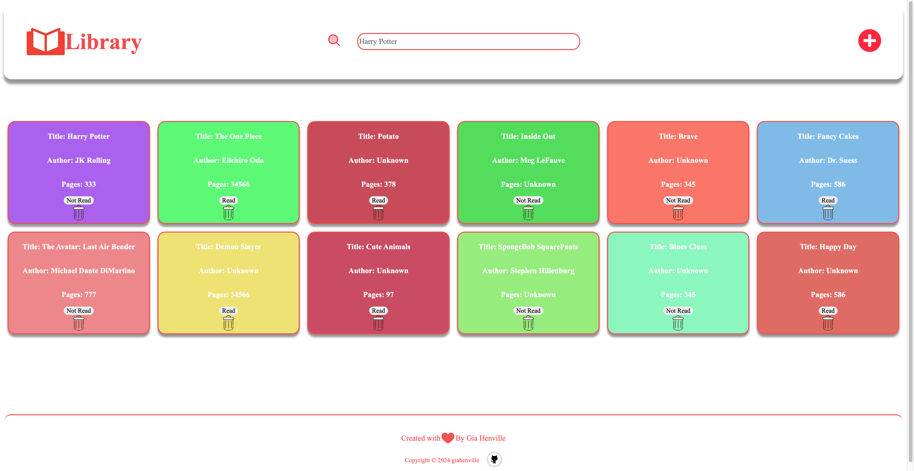
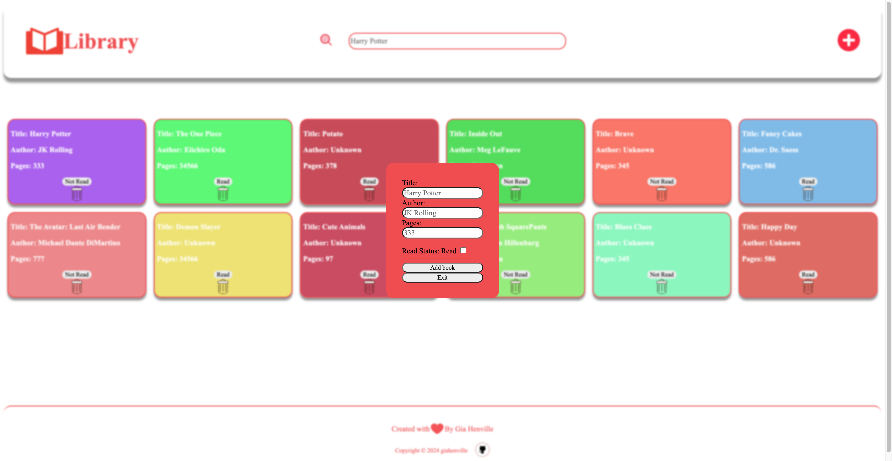

# Library

This is my implementation of the Library project from The Odin Project. Try it [here](https://giahenville.github.io/Library/).

## Description:

This project serves as a platform for me to enhance my JavaScript skills. It facilitates users in managing their book collection, tracking books they want to read or have already read.

## Features:

* Fully responsive to fit various screen sizes
* Addition of books to the library via a modal window
* Deletion of books
* Toggle read status for each book
* Display of each book on the screen
* Easy opening and closing of the modal window
* Book title and author search functionality within the library using a search bar

## Skills I learned:

* Creating modal windows
* Collecting form data and dynamically updating the page using JavaScript
* Dynamically generating HTML elements through JavaScript
* Utilizing event listeners for user interaction
* Employing JavaScript objects for storing and retrieving user data
* Writing clean and readable code
* Randomizing background color and implementing it through JavaScript
* Utilize CSS positioning 
* Implementing background blur on modal
